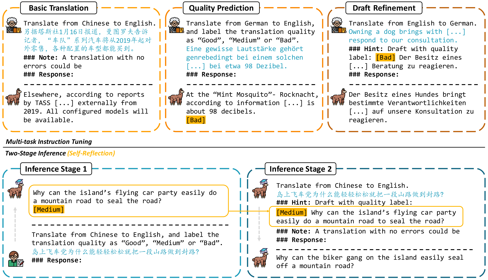

# ReflectionLLMMT

<div align="center">
    </img>
    <p class="image-caption">TasTe: Teaching Large Language Models to Translate through Self-Reflection</p>
</div>

## **📣 News**

- **[24/04/2024] Our code and dataset for TasTe is released!**
- **[15/05/2024] Our paper is accepted to the [ACL 2024](https://2024.aclweb.org/) main conference!**
- **[13/06/2024] Our paper is published on arXiv: [arXiv:2406.08434](https://arxiv.org/abs/2406.08434)!**
- **[17/08/2024] Our paper is accessible in [ACL Anthology](https://aclanthology.org/2024.acl-long.333/)! Please cite our paper in [this format](#citation).**


## **🔗 Quick Links**

- **[About TasTe](#about)**
- **[File Structure](#structure)**
- **[Requirements](#requirements)**
- **[Quick Start](#start)**
- **[Citation](#citation)**


## **🤖 About TasTe**<a name="about"></a>
The **TasTe** framework, which is short for **Teaching Large Language Models to Translate through Self-Reflection**, is designed as a two-stage inference process to enhance the translation quality of MT-LLMs. It consists of the following two stages:

- **Stage 1**: Generate preliminary translations (i.e. drafts) and conduct self-assessment of the translation quality at the same time.
- **Stage 2**: Refine the preliminary translations according to the predicted quality levels to obtain final outputs.

To ensure the sufficient capability for the entire self-reflective translation process, the LLMs are fine-tuned on a multi-task training set. The dataset consists of three parts:

- **Basic Translation**: Common parallel corpus to provide the LLMs with correct multilingual knowledge.
- **Quality Prediction**: Sources and translation candidates with their evaluated COMET scores to equip the LLMs with knowldge about translation quality and capabilities to make translation assessments.
- **Draft Refinement**: Preliminary translations with their COMET scores and enhanced translations to teach the LLMs to refine drafts according to their quality scores.

<div align="center">
    </img>
    <p class="image-caption">The Framework of TasTe</p>
</div>


## **📜 File Structure**<a name="structure"></a>
| Directory      | Contents                     |
| -------------- | ---------------------------- |
| [`checkpoints/`](https://github.com/YutongWang1216/ReflectionLLMMT/tree/main/checkpoints) | Fine-tuned model checkpoints |
| [`data/`](https://github.com/YutongWang1216/ReflectionLLMMT/tree/main/data)        | Experimental Data            |
| [`infer/`](https://github.com/YutongWang1216/ReflectionLLMMT/tree/main/infer)       | Testing scripts              |
| [`results/`](https://github.com/YutongWang1216/ReflectionLLMMT/tree/main/results)     | Testing outputs              |
| [`train/`](https://github.com/YutongWang1216/ReflectionLLMMT/tree/main/train)       | Fine-tuning scripts          |


## **🛠️ Requirements**<a name="requirements"></a>
TasTe is developed with [HuggingFaces's transformers](https://github.com/huggingface/transformers) and [Deepspeed-chat](https://github.com/microsoft/DeepSpeedExamples/tree/master/applications/DeepSpeed-Chat).
- Python 3.7.9
- Pytorch 1.13.1+cu111
- Transformers==4.28
- accelerate==0.19.0
- numpy==1.21.6
- deepspeed==0.9.0
- scikit-learn

## **🚀 Quick Start**<a name="start"></a>

### **Installation**

```bash
git clone https://github.com/YutongWang1216/ReflectionLLMMT.git
cd ReflectionLLMMT
pip install -r requirments.txt
```

### **Fine-tuning for TasTe models**

(1) **FixEmb**: Tuning with Embedding Layers Fixed

- [train/train_fixemb.sh](https://github.com/YutongWang1216/ReflectionLLMMT/tree/main/train/train_fixemb.sh)


(2) **Full**: Tuning with Full Parameters

- [train/train_full.sh](https://github.com/YutongWang1216/ReflectionLLMMT/tree/main/train/train_full.sh)

Make sure to fill in the following parameters before running:

```bash
work_dir=/path/to/ReflectionLLMMT      # path to the ReflectionLLMMT root directory
model_name=name_of_your_model          # name your model, e.g. bloom_fixemb
settings=tc                            # training settings, choices=[tc, qe, mt]
premodel=/path/to/original/checkpoint  # path to the pretrained model checkpoint directory
GPU_NUM=8                              # number of available GPUs
GPU=0,1,2,3,4,5,6,7                    # GPU ids
```

There are three choices of training settings, corresponsing to three different training sets:

1. *tc* - Fine-tune with data in [data/train_tc.json](https://github.com/YutongWang1216/ReflectionLLMMT/tree/main/data/train_tc.json) to get a TasTe model in Text Classification style.
2. *qe* - Fine-tune with data in [data/train_qe.json](https://github.com/YutongWang1216/ReflectionLLMMT/tree/main/data/train_qe.json) to get a TasTe model in Quality Estimation style.
3. *mt* - Fine-tune with data in [data/train_mt.json](data/train_mt.json) to get a MT-baseline model.

### **Evaluating TasTe models**

- [infer/test.sh](https://github.com/YutongWang1216/ReflectionLLMMT/tree/main/infer/test.sh)

Make sure to fill in the following parameters before running:

```bash
work_dir=/path/to/ReflectionLLMMT  # path to the ReflectionLLMMT root directory
lang=zh-en                         # language pair to be tested in, choices=['zh-en', 'en-zh', 'de-en', 'en-de']
test_model=name_of_model           # name of the fine-tuned model you gave
settings=tc                        # model settings, choices=[tc, qe, mt]
GPU_NUM=8                          # number of available GPUs
```

There are also three choices of testing settings, corresponsing to three different training settings:

1. *tc* - Test a TasTe model in Text Classification style.
2. *qe* - Test a TasTe model in Quality Estimation style.
3. *mt* - Test a MT-baseline model.


## **📝 Citation**<a name="citation"></a>
If you find this repo useful, please cite our paper as:
```
@inproceedings{wang-etal-2024-taste,
    title = "{T}as{T}e: Teaching Large Language Models to Translate through Self-Reflection",
    author = "Wang, Yutong  and
      Zeng, Jiali  and
      Liu, Xuebo  and
      Meng, Fandong  and
      Zhou, Jie  and
      Zhang, Min",
    editor = "Ku, Lun-Wei  and
      Martins, Andre  and
      Srikumar, Vivek",
    booktitle = "Proceedings of the 62nd Annual Meeting of the Association for Computational Linguistics (Volume 1: Long Papers)",
    month = aug,
    year = "2024",
    address = "Bangkok, Thailand",
    publisher = "Association for Computational Linguistics",
    url = "https://aclanthology.org/2024.acl-long.333",
    pages = "6144--6158",
    abstract = "Large language models (LLMs) have exhibited remarkable performance in various natural language processing tasks. Techniques like instruction tuning have effectively enhanced the proficiency of LLMs in the downstream task of machine translation. However, the existing approaches fail to yield satisfactory translation outputs that match the quality of supervised neural machine translation (NMT) systems. One plausible explanation for this discrepancy is that the straightforward prompts employed in these methodologies are unable to fully exploit the acquired instruction-following capabilities. To this end, we propose the $\textbf{TasTe}$ framework, which stands for translating through self-reflection. The self-reflection process includes two stages of inference. In the first stage, LLMs are instructed to generate preliminary translations and conduct self-assessments on these translations simultaneously. In the second stage, LLMs are tasked to refine these preliminary translations according to the evaluation results. The evaluation results in four language directions on the WMT22 benchmark reveal the effectiveness of our approach compared to existing methods. Our work presents a promising approach to unleash the potential of LLMs and enhance their capabilities in MT. The codes and datasets are open-sourced at https://github.com/YutongWang1216/ReflectionLLMMT.",
}
```
